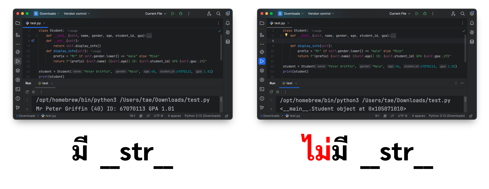
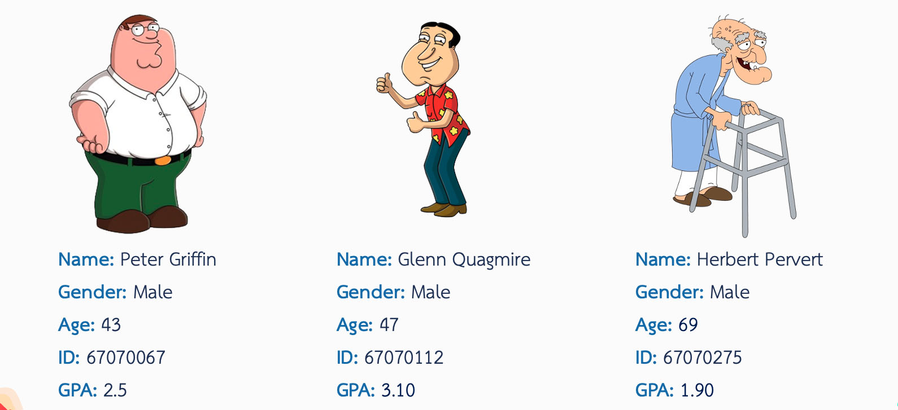

# Creating a Student Class

## **Step-by-Step Guide**

### 1. **Define the Class**

เริ่มต้นด้วยการสร้างคลาสที่ชื่อว่า `Student` โดยคลาสใน Python ทำหน้าที่เป็นโครงสร้างที่ใช้สำหรับสร้างออบเจกต์
ซึ่งในกรณีนี้จะเป็นตัวแทนของนักศึกษาแต่ละคน

```python
class Student:
    ...
```

### 2. **Initialize Attributes**

เมธอด `__init__` จะถูกใช้เพื่อกำหนดค่าเริ่มต้นให้กับแอตทริบิวต์ของออบเจกต์เมื่อมีการสร้างคลาส

- **Attributes**:
    - `name`: ชื่อของนักศึกษา
    - `gender`: เพศของนักศึกษา
    - `age`: อายุของนักศึกษา
    - `student_id`: รหัสนักศึกษาที่ไม่ซ้ำกัน
    - `gpa`: เกรดเฉลี่ยสะสม (GPA)

```python
class Student:
    def __init__(self, name, gender, age, student_id, gpa):
        self.name = name
        self.gender = gender
        self.age = age
        self.student_id = student_id
        self.gpa = gpa
```

เวลาสร้าง Object ชึ้นมา

```python
student = Student(name, gender, age, student_id, gpa)
```

---

### 3. **Add Methods for Functionality**

#### a) `display_info()`

เมธอดนี้จะแสดงข้อความที่จัดรูปแบบข้อมูลของนักศึกษา

- **Logic**:
    - ใช้คำนำหน้าชื่อ (`Mr` สำหรับเพศชาย, `Miss` สำหรับเพศหญิง)
    - แสดง GPA ด้วยทศนิยม 2 ตำแหน่ง

```python
def display_info(self):
    prefix = "Mr" if self.gender.lower() == "male" else "Miss"
    return f"{prefix} {self.name} ({self.age}) ID: {self.student_id} GPA {self.gpa:.2f}"
```

#### b) Override the `__str__` Method

การ Override ใน OOP (Object-Oriented Programming) หมายถึงการเขียนเมธอดในคลาสลูก (Subclass)
เพื่อแทนที่หรือปรับเปลี่ยนพฤติกรรมของเมธอดที่มีอยู่แล้วในคลาสแม่ (Superclass)
โดยที่เมธอดในคลาสลูกมีชื่อและพารามิเตอร์เหมือนกับในคลาสแม่

เมธอด `__str__` ช่วยให้สามารถแปลงออบเจกต์เป็นสตริงได้โดยตรงเมื่อใช้ฟังก์ชัน str() หรือ print() และจะเรียกใช้งานเมธอด
display_info() เพื่อแสดงข้อมูลนักศึกษา

```python
def __str__(self):
    return self.display_info()
```



---

## **Full Implementation**

```python
class Student:
    def __init__(self, name, gender, age, student_id, gpa):
        self.name = name
        self.gender = gender
        self.age = age
        self.student_id = student_id
        self.gpa = gpa

    def __str__(self):
        return self.display_info()

    def display_info(self):
        prefix = "Mr" if self.gender.lower() == "male" else "Miss"
        return f"{prefix} {self.name} ({self.age}) ID: {self.student_id} GPA {self.gpa:.2f}"
```

---

## **Testing the Student Class**

### Example Usage:



1. **Creating Objects**  
   สร้างออบเจกต์ของคลาส `Student`

```python
peter = Student("Peter Griffin", "Male", 43, 67070067, 2.50)
quagmire = Student("Glenn Quagmire", "Male", 47, 67070112, 3.10)
herbert = Student("Herbert Pervert", "Male", 69, 67070275, 1.90)
```

2. **Displaying Information**  
   ใช้ฟังก์ชัน `print()` เพื่อแสดงข้อมูลนักศึกษา

```python
print(peter)
print(quagmire)
print(herbert)
```

### Output:

```
Mr Peter Griffin (43) ID: 67070067 GPA 2.50
Mr Glenn Quagmire (47) ID: 67070112 GPA 3.10
Mr Herbert Pervert (69) ID: 67070275 GPA 1.90
```

---
