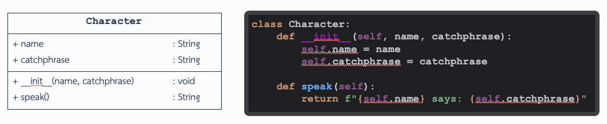
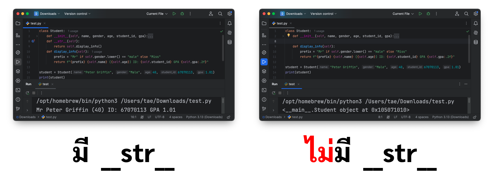

# Data Structures and Algorithms

**06066301 วิชาโครงสร้างข้อมูลและอัลกอริทึม (Data Structures and Algorithms)**

**Lab Documentation**

[Link to slide (.pptx)](https://kmitlthailand.sharepoint.com/:p:/s/22567-ITDataStructuresandAlgorithms/EYTAfdFk63FPtg0bDpEH4zwB7zVpzDUalj2iUnLXYamacw?e=horVXX)

# Python Class

## Python

* เป็น ภาษาระดับสูง (High-level language)
* เป็น Dynamic Programming Language (ภาษาที่สามารถแยกชนิดตัวแปรได้)
* สามารถรองรับการเขียนได้หลายรูปแบบ ได้แก่
    * โครงสร้างเชิงวัตถุ (Object Oriented Programming)
    * การเขียนเชิงฟังก์ชัน (Functional Programming)
    * มีส่วนขยายเสริมสำหรับการเขียนเชิงตรรกะ
* เป็น Open Source สามารถโหลดแล้วใช้งานได้เลย
* ใช้ Interpreter ในการแปลงโค้ด
* Python เวอร์ชั่นล่าสุดคือ 3.13.0

## วิธีลง Python

* **Windows**
    * [https://www.python.org/downloads/](https://www.python.org/downloads/)
    * `py --version`  คำสั่งในการเช็ค Version ของ Python ใน Windows
* **Mac OS:** สามารถลงผ่าน Homebrew โดยใช้คำสั่ง: [https://brew.sh/](https://brew.sh/)
    * `/bin/bash -c "$(curl -fsSL https://raw.githubusercontent.com/Homebrew/install/HEAD/install.sh)"`
* **Ubuntu:** ลงผ่าน apt โดยใช้คำสั่ง:
    * `sudo apt install python3`
    * `python3 --version` คำสั่งในการเช็ค Version ของ Python ใน MacOS, Ubuntu

## Interpreter

คือ ตัวแปรภาษา ระหว่างภาษามนุษย์กับภาษาคอมพิวเตอร์ให้เป็น 1 กับ 0
เพราะคอมพิวเตอร์อ่านได้แค่นั้นทำให้ต้องแปลงภาษาเป็นภาษาที่มนุษย์เข้าใจให้เป็นภาษาของ machine language
ก่อนที่คอมพิวเตอร์ถึงจะประมวณผลได้

## Interpreter VS Compiler

| Interpreter                                                   | Compiler                             |
|---------------------------------------------------------------|--------------------------------------|
| แปลงทีละบรรทัดระหว่างทำงานทีละบรรทัด                          | แปลงให้หมดก่อนแล้วค่อยทำงาน          |
| ระหว่างรัน ถ้าเจอ Error ในบรรทัดที่ทำงานอยู่ก็หยุดการรันทันที | ระหว่างแปลง ถ้าเจอ Error ก็ไม่รันเลย |
| ตัวอย่างภาษาที่ใช้: Python, Ruby และ JavaScript               | ตัวอย่างภาษาที่ใช้: C, C++ และ Java  |


## ชนิดของตัวแปรทั่วไปใน Python

ชนิดของข้อมูลในภาษา Python จะมีอยู่ 4 ตัวหลักๆ คือ

1. **String**
    * String คือชุดข้อความที่คลุมด้วย "" (Double Quote), '' (Single Quote) หรือ """ """ (Triple Quote)
    * ไม่สนว่าจะเป็นอะไรแค่คลุมด้วย Double Quote หรือ Single Quote เช่น “0.01” นับเป็นข้อมูลประเภท String

2. **Integer**
    * Int คือข้อมูลตัวเลขจำนวนเต็ม เช่น 1, 0, -5
    * ใช้แยกกับ float ที่เป็นจำนวนจริง

3. **Float**
    * float คือข้อมูลตัวเลขจำนวนจริงและทศนิยม เช่น 1.0, 3.141592653589 เป็นต้น

4. **Boolean**
    * bool คือชนิดข้อมูลตรรกศาสตร์ มี 2 ค่าคือ True กับ False

## การประกาศตัวแปร

* เราสามารถสร้างตัวแปร เพื่อเก็บข้อมูลประเภทต่างๆ ได้
* ไม่จำเป็นต้องกำหนดชนิดข้อมูลให้กับตัวแปร
* การสร้างตัวแปรนั้นควรมีลักษณะดังนี้
    * ตัวอักษรต้องมีมากกว่า 3 อักษรขึ้นไป
    * ตัวอักษรต้องเป็นตัวพิมพ์เล็กทั้งหมด
    * ชื่อของตัวแปรควรจะมีความหมายเพื่อให้ง่ายต่อการเรียกใช้
    * การประกาศตัวแปรนั้นห้ามใช้อักษรพิเศษยกเว้นตัว Underscore (_)

## โมดูล (Module) ใน Python

นอกจากนี้ Python ยังเปิดโอกาสให้เพิ่มเติมโมดูลพิเศษที่นอกเหนือจากที่ Python โมดูลพิเศษเหล่านี้ก็ได้รับการพัฒนาจาก
Python, C, C++, Java, Dot Net หรือภาษาอื่นๆ


## การเรียกใช้โมดูล

คำสั่งที่เราใช้ในการอ้างอิงโมดูลมาตรฐานหรือโมดูลเพิ่มเติมพิเศษใน Python ประกอบไปด้วย 2 คำสั่งดังนี้

1. **คำสั่ง `import`** เป็นการอ้างอิงโมดูลที่เราต้องการโดยใช้กลุ่มคำสั่งภายในตัวโมดูล

    ```python
    import datetime
    import datetime, decimal, os
    ```

2. **คำสั่ง `from`** เป็นการอ้างอิงโมดูลที่เราต้องการเฉพาะกลุ่มคำสั่งภายในตัวโมดูลที่เราต้องการ

    ```python
    from os import error, chdir, getcwd
    ```

## การสร้างฟังก์ชัน


ฟังก์ชัน (Function) คือ ส่วนชุดคำสั่งของโค้ดที่ถูกมาสร้างมาทำงานเพื่อวัตถุประสงค์บางอย่าง
ในการเขียนโปรแกรมเรามักจะแยกโค้ดที่มีการทำงานเหมือนๆ กันเป็นฟังก์ชันเอาไว้และ เรียกใช้ฟังก์ชันนั้นซ้ำๆ
ซึ่งเป็นแนวคิดของการนำโค้ดกลับมาใช้ใหม่

* `def` ย่อมาจากคำว่า “define” ทำหน้าที่เป็นคำสั่งในการประกาศฟังก์ชัน
* `main()` คือการตั้งชื่อของฟังก์ชัน อย่างในตัวอย่าง ฟังก์ชันนี้มีชื่อว่า “main” (น้อง ๆ สามารถเปลี่ยนชื่อฟังก์ชันได้)

*ในบรรทัดแรกฟังก์ชันและโปรแกรมต้องมีการสร้าง docstring ขึ้นมาด้วย เพื่อไม่ให้ผิดหลัก PEP-8 ใน <i\>Judge

## รูปแบบการสร้างฟังก์ชัน

ลักษณะการสร้างฟังก์ชันมีรูปแบบของการเขียนที่ค่อนข้างง่าย มีวิธีการเขียนฟังก์ชันที่แบ่งตามการนำไปใช้งาน 4 รูปแบบ ได้แก่

1. การสร้างฟังก์ชันที่ไม่มีการส่งค่าใดๆ กลับ
2. การสร้างฟังก์ชันมีไม่มีการส่งค่าใดๆ กลับแต่มีการส่งผ่านค่าร่วมกับตัวแปรอาร์กิวเมนต์
3. การสร้างฟังก์ชันร่วมกับการส่งค่าผลลัพธ์กลับ
4. การสร้างฟังก์ชันที่มีการใช้ตัวแปรอาร์กิวเมนต์และการส่งค่าผลลัพธ์กลับ

---

# การเขียนโปรแกรมเชิงวัตถุ (OOP)

## การเขียนโปรแกรมเชิงวัตถุ (OOP)

* นอกจากการใช้งานฟังก์ชันที่เป็นแบบทั่วไปแล้ว
  ก็มีการสร้างหรือเขียนฟังก์ชันเพื่อใช้งานภายใต้รูปแบบการเขียนโปรแกรมเชิงวัตถุ (Object-Oriented Programming)
    * เราจะเรียกว่าเป็น Class Module
    * เปลี่ยนชื่อเรียกฟังก์ชันใหม่เป็นคำว่า Method ของ Class Module
    * แบ่งลักษณะการใช้งาน Method ออกเป็น 2 ลักษณะการใช้งาน คือ
        * Internal Method หรือ Private Method
        * Interface Method

## ลักษณะการใช้งาน Method ของ Class

1. **Internal Method หรือ Private Method**
    * Method ลักษณะนี้คือ ฟังก์ชันที่สร้างขึ้นเพื่อใช้งานเฉพาะภายใน Class Method
    * ฟังก์ชันลักษณะนี้ไม่สามารถเรียกใช้งานโดยตรงจากภายนอก
    * อีกทั้งในแต่ละ Class Method ยังมี Internal Method แบบ Built-in ภายในแต่ละ Class Module ซึ่งบางครั้งก็เรียกว่า
      Operation Internal Method
        * เช่น `__init__`, `__format__`, `__len__` ฯลฯ

2. **Interface Method**
    * เป็น Method ที่ต้องการสร้างใน Class เพื่อเรียกใช้งานจากภายนอกได้
    * จะใช้วิธีประกาศใช้ Class Object ซึ่งรูปแบบการเขียนโปรแกรมเพื่อสร้าง Method
    * มีวิธีเขียนเหมือนกับการสร้างฟังก์ชันทั่วไป


## Python Class

**คลาส (Class)** เปรียบเสมือนเป็นพิมพ์เขียว (Blueprint) หรือต้นแบบที่ใช้สร้างวัตถุ (Object) โดยจะมีแอตทริบิวต์ (
attributes) และเมธอด (methods)

**คลาสใน Python**

* การสร้างคลาส: ใช้คีย์เวิร์ด `class`
* แอตทริบิวต์: คือตัวแปรที่อยู่ภายในคลาส
* แอตทริบิวต์เป็น public เสมอ: เข้าถึงได้โดยใช้จุด (.) เช่น `peter.age`

## Class Diagram

Class Diagram คือ Diagram ในรูปแบบของ UML ที่ใช้แสดงโครงสร้างของระบบเชิงโดยแสดง Class, Relationship, Attributes และ
Method



## Python Objects

**Object (วัตถุ)** คือเอนทิตีที่มี **สถานะ (State)** และ **พฤติกรรม (Behavior)**

ใน Python จะนับ Integer, String, arrays, and dictionaries เป็นวัตถุทุกตัว

**โครงสร้างของวัตถุ (Object Structure):**

1. **State (สถานะ):** แสดงผ่าน attributes ซึ่งสะท้อนคุณสมบัติของวัตถุ เช่น สี อายุ หรือชนิด
2. **Behavior (พฤติกรรม):** แสดงผ่าน methods ซึ่งสะท้อนการตอบสนองของวัตถุต่อการโต้ตอบ เช่น การกินหรือการนอน

## องค์ประกอบของคลาส


1. **Constructor**

    * `__init__` เป็นเมธอด constructor ที่ใช้สำหรับกำหนดค่าเริ่มต้นให้กับ instance ของคลาส Character
    * มีพารามิเตอร์สองตัวคือ `self` (อ้างถึง instance ที่ถูกสร้างขึ้น), `name` (ชื่อของตัวละคร) และ `catchphrase`
    * พารามิเตอร์ `name`, `catchphrase` นี้จะถูกใช้เพื่อกำหนดค่าให้กับแอตทริบิวต์ของ instance แต่ละตัวของคลาส Character

2. **เมธอด speak**

    * ทำหน้าที่คืนข้อความที่รวมชื่อของตัวละครและวลีประจำตัวในรูปแบบ "ชื่อของตัวละครที่พูด: วลีประจำตัว"
    * `self`: เมธอดนี้เป็นเมธอดในคลาส ดังนั้นจะรับพารามิเตอร์ `self` ซึ่งหมายถึง instance ของคลาสที่เรียกใช้งานเมธอด
    * ภายในเมธอด speak ใช้ `self.name` เพื่อดึงค่าชื่อ (name) ของตัวละคร และใช้ `self.catchphrase`
      เพื่อดึงค่าของวลีประจำตัว (catchphrase) ของตัวละครใน instance ที่กำลังทำงาน

## การสร้างวัตถุ


1. **สร้างอ็อบเจ็กต์ peter**
    * `peter` คืออ็อบเจ็กต์ที่ถูกสร้างจากคลาส Character
    * เมื่อสร้างอ็อบเจ็กต์นี้ จะเรียกใช้งานคอนสตรัคเตอร์ `__init__` ของคลาส Character
    * Constructor จะได้รับค่าพารามิเตอร์สองค่า:
        * "Peter Griffin" จะถูกเก็บในแอตทริบิวต์ `self.name`
        * "Bird is the word" จะถูกเก็บในแอตทริบิวต์ `self.catchphrase`


2. **เรียกเมธอด speak**
    * เมธอด speak จะถูกเรียกใช้จากอ็อบเจ็กต์ `peter`
    * ในเมธอด speak ข้อความจะถูกสร้างโดยการเข้าถึงค่าของแอตทริบิวต์ `self.name` และ `self.catchphrase`

# ตัวอย่างการใช้คลาส

## Student Class

* คุณฉงนต้องการโปรแกรมรับรายละเอียดนักศึกษาโดยรับรายละเอียดนักศึกษาทั้งหมด 3 คน
* หลังจากรับค่ามาครบแล้วคุณฉงนสามารถเลือกได้ว่าจะให้แสดงผลข้อมูลของนักศึกษาคนไหนผ่านรหัสนักศึกษาของนักศึกษาคนนั้น
* โปรแกรมนั้นจะต้องเก็บข้อมูลของนักศึกษาทั้งหมด 3 คนโดยที่ในแต่ละคนต้องเก็บข้อมูลดังนี้
    * ชื่อ, เพศ, อายุ, รหัสนักศึกษา, เกรดเฉลี่ย
* ถ้าไม่เจอข้อมูลของนักศึกษาให้แสดงคำว่า "Student not found"

## เราต้องสร้าง Object นักศึกษาจากคลาส Student


## ถ้าเขียนโปรแกรมโดยไม่ใช้ Class ก็จำเป็นต้องประกาศตัวแปรให้ครบทุกตัว เช่น


## จากตัวอย่างที่ผ่านมา หากนำข้อมูลของตัวละครมาประกอบกันเป็นโครงสร้างวัตถุของตัวละครและใช้งานตัวแปรชนิดวัตถุแทนการประกาศตัวแปรแบบปกติที่เรียนมาสามารถประกาศตัวแปรได้ดังนี้


## คลาสสามารถใช้สร้างวัตถุได้หลายตัว


# Creating a Student Class

## **Step-by-Step Guide**

### 1. **Define the Class**

เริ่มต้นด้วยการสร้างคลาสที่ชื่อว่า `Student` โดยคลาสใน Python ทำหน้าที่เป็นโครงสร้างที่ใช้สำหรับสร้างออบเจกต์
ซึ่งในกรณีนี้จะเป็นตัวแทนของนักศึกษาแต่ละคน

```python
class Student:
    ...
```

### 2. **Initialize Attributes**

เมธอด `__init__` จะถูกใช้เพื่อกำหนดค่าเริ่มต้นให้กับแอตทริบิวต์ของออบเจกต์เมื่อมีการสร้างคลาส

- **Attributes**:
    - `name`: ชื่อของนักศึกษา
    - `gender`: เพศของนักศึกษา
    - `age`: อายุของนักศึกษา
    - `student_id`: รหัสนักศึกษาที่ไม่ซ้ำกัน
    - `gpa`: เกรดเฉลี่ยสะสม (GPA)

```python
class Student:
    def __init__(self, name, gender, age, student_id, gpa):
        self.name = name
        self.gender = gender
        self.age = age
        self.student_id = student_id
        self.gpa = gpa
```

เวลาสร้าง Object ชึ้นมา

```python
student = Student(name, gender, age, student_id, gpa)
```

---

### 3. **Add Methods for Functionality**

#### a) `display_info()`

เมธอดนี้จะแสดงข้อความที่จัดรูปแบบข้อมูลของนักศึกษา

- **Logic**:
    - ใช้คำนำหน้าชื่อ (`Mr` สำหรับเพศชาย, `Miss` สำหรับเพศหญิง)
    - แสดง GPA ด้วยทศนิยม 2 ตำแหน่ง

```python
def display_info(self):
    prefix = "Mr" if self.gender.lower() == "male" else "Miss"
    return f"{prefix} {self.name} ({self.age}) ID: {self.student_id} GPA {self.gpa:.2f}"
```

#### b) Override the `__str__` Method

การ Override ใน OOP (Object-Oriented Programming) หมายถึงการเขียนเมธอดในคลาสลูก (Subclass)
เพื่อแทนที่หรือปรับเปลี่ยนพฤติกรรมของเมธอดที่มีอยู่แล้วในคลาสแม่ (Superclass)
โดยที่เมธอดในคลาสลูกมีชื่อและพารามิเตอร์เหมือนกับในคลาสแม่

เมธอด `__str__` ช่วยให้สามารถแปลงออบเจกต์เป็นสตริงได้โดยตรงเมื่อใช้ฟังก์ชัน str() หรือ print() และจะเรียกใช้งานเมธอด
display_info() เพื่อแสดงข้อมูลนักศึกษา

```python
def __str__(self):
    return self.display_info()
```



---

## **Full Implementation**

```python
class Student:
    def __init__(self, name, gender, age, student_id, gpa):
        self.name = name
        self.gender = gender
        self.age = age
        self.student_id = student_id
        self.gpa = gpa

    def __str__(self):
        return self.display_info()

    def display_info(self):
        prefix = "Mr" if self.gender.lower() == "male" else "Miss"
        return f"{prefix} {self.name} ({self.age}) ID: {self.student_id} GPA {self.gpa:.2f}"
```

---

## **Testing the Student Class**

### Example Usage:


1. **Creating Objects**  
   สร้างออบเจกต์ของคลาส `Student`

```python
peter = Student("Peter Griffin", "Male", 43, 67070067, 2.50)
quagmire = Student("Glenn Quagmire", "Male", 47, 67070112, 3.10)
herbert = Student("Herbert Pervert", "Male", 69, 67070275, 1.90)
```

2. **Displaying Information**  
   ใช้ฟังก์ชัน `print()` เพื่อแสดงข้อมูลนักศึกษา

```python
print(peter)
print(quagmire)
print(herbert)
```

### Output:

```
Mr Peter Griffin (43) ID: 67070067 GPA 2.50
Mr Glenn Quagmire (47) ID: 67070112 GPA 3.10
Mr Herbert Pervert (69) ID: 67070275 GPA 1.90
```

---

# Labs Week01 – Python Class

**Lab Documentation (Lab 1)**

## วิธีการอ่าน Class Diagram

Class Diagram จะมี 3 ส่วนคือ

1. **Class Name (ชื่อคลาส)**
2. **Attributes (คุณลักษณะ)**
    * `int` คือคุณลักษณะที่มีชนิดเป็น int
    * `float` คือคุณลักษณะที่มีชนิดเป็น float
    * `Object` คือคุณลักษณะที่มีชนิดเป็น Object
3. **Methods (เมธอด)**
    * `void` คือเมธอดที่ไม่มีการ return ค่าใดๆ เลย
    * `float` คือเมธอดที่ return ค่าเป็น float
    * `int` คือเมธอดที่ return ค่าเป็น int
    * `tuple` คือเมธอดที่ return ค่าเป็น tuple


## Lab 01.01 - Is_Even

* จงเขียนฟังก์ชัน `is_even()` ที่รับค่าตัวเลขจำนวนเต็ม 1 ค่า (k) และทำการคืนค่า (return) ผลลัพธ์เป็นค่า True หรือ False
    * คืนค่า True ก็ต่อเมื่อ k เป็นเลขคู่
    * ไม่เช่นนั้น ให้คืนค่า False
* ไม่อนุญาตให้ใช้โอเปอเรเตอร์สำหรับการคูณ การ mod หรือ การหาร

* **ตัวอย่าง**
    * `is_even(22)`
    * ผลลัพธ์ คือ True

## Lab 01.02 - Min Max Avg

* สร้างฟังก์ชันที่รับค่าลิสต์ข้อมูลคะแนนและทำการคืนค่าผลลัพธ์ต้องออกมาเป็นข้อมูล tuple ความยาว 3
  ข้อมูลที่ประกอบไปด้วยค่ามากสุด, ค่าน้อยสุดและค่าเฉลี่ยของข้อมูลที่รับเข้ามา
    * ข้อมูลทุกตัวจะต้องโดนปัดทศนิยมให้เหลือ 2 ตำแหน่งผ่านคำสั่ง `round(x, 2)`
* ไม่อนุญาตให้ใช้ Built-In function `min()`, `max()`

* **ตัวอย่าง**
    * `your_function([22, 54, 7, 87, 12, 9, 63, 55, 48])`
    * ผลลัพธ์ คือ (7, 87, 39.67)

## Lab 01.03 - SwapVar

* สร้างฟังก์ชันที่ทำหน้าที่สลับค่าของตัวแปรทั้งสองตัวนี้จากข้อมูล tuple ขนาด 2 ข้อมูล
    * ชนิดของข้อมูลใน tuple ผลลัพธ์ต้องเป็น float เท่านั้น

* **ตัวอย่าง**
    * เช่น `function((6, 8))`
    * ผลลัพธ์ คือ (8.0, 6.0)

**(โค้ด Python สำหรับรับ input)**

## Lab 01.04 - Student Class (No Class)

คุณฉงนต้องการโปรแกรมรับรายละเอียดนักศึกษาโดยรับรายละเอียดนักศึกษาทั้งหมด 3 คน
หลังจากรับค่ามาครบแล้วคุณฉงนสามารถเลือกได้ว่าจะให้แสดงผลข้อมูลของนักศึกษาคนไหนผ่านรหัสนักศึกษาของนักศึกษาคนนั้น
โดยที่โปรแกรมนั้นจะต้องเก็บข้อมูลของนักศึกษาทั้งหมด 3 คนโดยที่ในแต่ละคนต้องเก็บข้อมูลดังนี้

* ชื่อ, เพศ, อายุ, รหัสนักศึกษา, เกรดเฉลี่ย

ถ้าไม่เจอข้อมูลของนักศึกษาให้แสดงคำว่า "Student not found"

**REMARK:** ในข้อนี้ให้ลองเขียนแบบไม่ใช้ Class ในการสร้าง Object, ให้เก็บเป็นตัวแปรของนักศึกษา 3 คนแทน ห้ามนักศึกษาใช้
OOP, Dictionary หรือสร้างคลาสในข้อนี้โดยเด็ดขาด

## Lab 01.05 - Student Class (With Class)

คุณฉงนต้องการโปรแกรมรับรายละเอียดนักศึกษาโดยรับรายละเอียดนักศึกษาทั้งหมด 3 คน
หลังจากรับค่ามาครบแล้วคุณฉงนสามารถเลือกได้ว่าจะให้แสดงผลข้อมูลของนักศึกษาคนไหนผ่านรหัสนักศึกษาของนักศึกษาคนนั้น
โดยที่โปรแกรมนั้นจะต้องเก็บข้อมูลของนักศึกษาทั้งหมด 3 คนโดยที่ในแต่ละคนต้องเก็บข้อมูลดังนี้

* ชื่อ, เพศ, อายุ, รหัสนักศึกษา, เกรดเฉลี่ย

ถ้าไม่เจอข้อมูลของนักศึกษาให้แสดงคำว่า "Student not found"

**REMARK:** ในข้อนี้ให้ลองใช้ Class ในการสร้าง Object ของนักศึกษาแต่ละคนขึ้นมาดู, ลองออกแบบและสร้างคลาสเอง ห้ามใช้
Dictionary ในข้อนี้โดยเด็ดขาด

## Lab 01.06 - Rectangle

ให้สร้างคลาสที่ชื่อว่า Rectangle ขึ้นมาโดยที่ภายในคลาสนี้จะมี Attribute 2 ตัวและ Method 2 ตัวดังนี้

* **Attributes (คุณลักษณะ) ได้แก่**
    * ค่าความสูง (จำนวนจริง)
    * ค่าความกว้าง (จำนวนจริง)
* **Methods (เมธอด) ได้แก่**
    * `calculate_area()` ทำหน้าที่คำนวณค่าของพื้นที่ของสี่เหลี่ยมและ return ค่ากลับ
    * `calculate_perimeter()` ทำหน้าที่คำนวณหาความยาวรอบรูปของสี่เหลี่ยมและ return ค่ากลับ


วิธีการรับ Input ใน <i\>Judge จะรับมาเป็นลำดับตามนี้

1. ค่าความสูง
2. ค่าความกว้าง
3. ค่าเงื่อนไข มี 2 ตัวได้แก่ {"area", "perimeter"}
    1. ถ้าค่าที่รับเข้ามาเป็น "area" ให้เรียกเมธอด `calculate_area()` พร้อมกับแสดงผลค่าพื้นที่ของสี่เหลี่ยม
    2. ถ้าค่าที่รับเข้ามาเป็น "perimeter" ให้เรียกเมธอด `calculate_perimeter()`
       พร้อมกับแสดงผลค่าความยาวรอบรูปของสี่เหลี่ยม