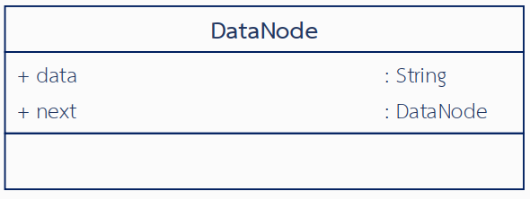
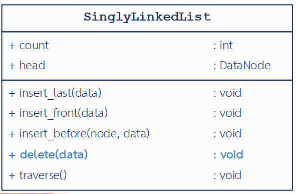

# Lab 03 - Singly Linked List
06066301 วิชาโครงสร้างข้อมูลและอัลกอริทึม (Data Structures and Algorithms)

## สารบัญ
1. [โครงสร้างพื้นฐาน](#โครงสร้างพื้นฐาน)
2. [คลาส DataNode](#คลาส-datanode)
3. [คลาส SinglyLinkedList](#คลาส-singlylinkedlist)
4. [รายละเอียดการใช้งาน](#รายละเอียดการใช้งาน)

## โครงสร้างพื้นฐาน

Singly Linked List ประกอบด้วยโหนดที่เชื่อมต่อกันในทิศทางเดียว แต่ละโหนดประกอบด้วย:
- ข้อมูล (เก็บในรูปแบบสตริง)
- การอ้างอิงไปยังโหนดถัดไป

### โครงสร้างคลาส

```python
class DataNode:
    def __init__(self, name=""):
        self.data = name
        self.next = None

class SinglyLinkedList:
    def __init__(self):
        self.count = 0
        self.head = None
```

## คลาส DataNode



### คุณลักษณะ (Attributes)
- `data`: เก็บข้อมูลของโหนด (ชนิดข้อมูลเป็นสตริง)
- `next`: เก็บการอ้างอิงไปยังโหนดถัดไป (เริ่มต้นเป็น None)

### ข้อกำหนด
- ต้องรับค่าข้อมูลผ่าน Constructor
- การอ้างอิงถัดไปเริ่มต้นเป็น None

### ตัวอย่างการใช้งาน
```python
pNew = DataNode("ตะวัน")
print(pNew.data)  # แสดงผล: ตะวัน
print(pNew.next)  # แสดงผล: None
```

## คลาส SinglyLinkedList



### คุณลักษณะ
- `count`: จำนวนโหนดในลิสต์ (เริ่มต้นที่ 0)
- `head`: อ้างอิงไปยังโหนดแรก (เริ่มต้นเป็น None)

### เมธอด (Methods)

#### 1. traverse()
- ท่องเข้าไปในลิสต์และแสดงข้อมูลทั้งหมดตามลำดับ
- ใช้ "->" เชื่อมระหว่างโหนด (เช่น "ตะวัน -> ซันจา")
- กรณีลิสต์ว่าง แสดงข้อความ "This is an empty list."

#### 2. insert_last(data)
- สร้างโหนดใหม่และเพิ่มที่ท้ายลิสต์
- อัปเดตจำนวนโหนด
- ตัวอย่าง:
```python
mylist.insert_last("นาดอส")  
# ผลลัพธ์: ตะวัน -> ซันจา -> นาดอส
```

#### 3. insert_front(data)
- สร้างโหนดใหม่และเพิ่มที่หน้าลิสต์
- อัปเดตจำนวนโหนด
- ตัวอย่าง:
```python
mylist.insert_front("นาดอส")  
# ผลลัพธ์: นาดอส -> ตะวัน -> ซันจา
```

#### 4. insert_before(node, data)
- สร้างโหนดใหม่และแทรกก่อนโหนดที่ระบุ
- แสดงข้อความ "Cannot insert, <node> does not exist." ถ้าไม่พบโหนดที่ระบุ
- ตัวอย่าง:
```python
mylist.insert_before("ซันจา", "นาดอส")  
# ผลลัพธ์: ตะวัน -> นาดอส -> ซันจา
```

#### 5. delete(data)
- ลบโหนดที่ระบุออกจากลิสต์
- แสดงข้อความ "Cannot delete, <data> does not exist." ถ้าไม่พบโหนดที่ระบุ
- อัปเดตจำนวนโหนด
- ตัวอย่าง:
```python
mylist.delete("ตะวัน")  
# ผลลัพธ์: ซันจา
```

## รายละเอียดการใช้งาน

### การสร้างและเชื่อมโยงโหนด
1. สร้างลิสต์ว่าง:
```python
mylist = SinglyLinkedList()  # count = 0, head = None
```

2. เพิ่มโหนดแรก:
```python
pNew = DataNode("ตะวัน")
mylist.head = pNew
```

3. เพิ่มโหนดถัดไป:
```python
pNew = DataNode("ซันจา")
mylist.head.next = pNew
```

### ตัวอย่างการทำงานของการดำเนินการต่างๆ

1. แทรกที่ด้านหน้า โดยการเรียกใช้ insert_front:
```python
ก่อน: [2] -> ตะวัน -> ซันจา
หลัง: [3] -> นาดอส -> ตะวัน -> ซันจา
```

2. แทรกก่อนโหนดที่ระบุ insert_before:
```python
ก่อน: [2] -> ตะวัน -> ซันจา
หลัง: [3] -> ตะวัน -> นาดอส -> ซันจา
```

3. ลบโหนด โดยการเรียกใช้ delete:
```python
ก่อน: [2] -> ตะวัน -> ซันจา
หลัง: [1] -> ซันจา
```

ตัวเลขในวงเล็บ [n] แสดงค่า count ของลิสต์
