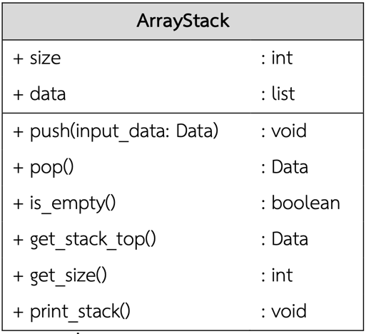
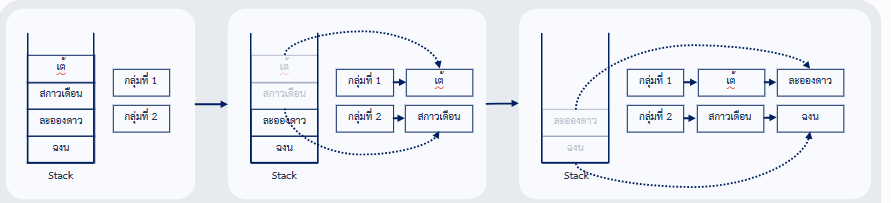

# เอกสารประกอบการปฏิบัติการ ครั้งที่ 2 : Stack


จงเขียนโปรแกรมเพื่อสร้าง ArrayStack และสามารถทำ Operation ต่างๆ ได้ ตามโครงสร้างคลาสในรูปที่ 1 ดังนี้



**รูปที่ 1** โครงสร้างคลาส ArrayStack

## แนวคิดการแก้โจทย์ปัญหา

1. เขียนโครงสร้างคลาส ArrayStack ให้มี attribute และ method (operation) ครบตามโครงสร้างในรูปที่ 1
2. เขียน method ในคลาสให้สมบูรณ์ ตามที่โจทย์กำหนด
3. ทดลองสร้างอ็อบเจ็ค stack จากคลาส ArrayStack และใช้อ็อบเจ็ค stack นั้นเรียกใช้ method (operation) ต่างๆ

## ขั้นตอนการปฏิบัติการ

1. สร้างคลาส ArrayStack ตามโครงสร้างในรูปที่ 1
    - คลาส ArrayStack ประกอบด้วย 2 แอตทริบิวต์ ได้แก่ size และ data
        - size เก็บขนาดข้อมูลของ stack มีชนิดข้อมูลเป็น int โดยกำหนดค่าเริ่มต้นเป็น 0
        - data เก็บข้อมูลใน stack มีชนิดข้อมูลเป็นลิสต์ โดยกำหนดค่าเริ่มต้นเป็น []
        - กำหนดค่าแอตทริบิวต์ใน `__init__()` ซึ่งจะถูกเรียกเมื่อทำการสร้างอ็อบเจ็ค นั่นคือ เมื่อสร้างอ็อบเจ็คแล้ว
          อ็อบเจ็คนั้นจะมีแอตทริบิวต์ size และ data ที่มีค่า 0 และ [] ตามลำดับ
    - คลาส ArrayStack ประกอบด้วย 6 เมธอด ได้แก่ เมธอด push(Data), pop(), is_empty(), get_stack_top(), get_size() และ
      print_stack()
        - กำหนดเป็นฟังก์ชันในคลาส ด้วยคำสั่ง def

โครงสร้างโค้ดโปรแกรมเป็นดังนี้

```python
class ArrayStack:
    def __init__(self):
        self.size = 0
        self.data = list()

    def push(self, input_data):

    # ทำฟังก์ชันให้สมบูรณ์

    def pop(self):

    # ทำฟังก์ชันให้สมบูรณ์

    def is_empty(self):

    # ทำฟังก์ชันให้สมบูรณ์

    def get_stack_top(self):

    # ทำฟังก์ชันให้สมบูรณ์

    def get_size(self):

    # ทำฟังก์ชันให้สมบูรณ์

    def print_stack(self):
# ทำฟังก์ชันให้สมบูรณ์
```

2. เขียนเมธอดในคลาสให้สมบูรณ์
    - `push(input_data)`:
        - ถ้าข้อมูลที่รับเข้ามา (input_data) เป็นตัวเลขจำนวนเต็มให้เก็บเป็น Int ;
          ถ้าข้อมูลที่รับเข้ามาเป็นตัวเลขจำนวนจริงให้เก็บเป็น Float ; ถ้าข้อมูลที่รับเข้ามาเป็นตัวอักษรให้เก็บเป็น
          String
        - ทำการเพิ่มข้อมูล input_data ที่ส่วน Top ของ Stack (ข้อมูลที่ถูกเพิ่มมาใหม่จะไปอยู่ที่ท้ายสุดของ self.data
          เสมอ)
        - เพิ่มค่า self.size
        - เขียนเมธอด push ให้สมบูรณ์ ดังรูปที่ 2

```python
def push(self, input_data):
    """Stack"""
    try:
        if input_data.isdigit():
            input_data = int(input_data)
        elif input_data.replace(".", "", 1).isdigit():
            input_data = float(input_data)
    except (TypeError, ValueError, ArithmeticError, AttributeError):
        pass
    finally:
        self.data.append(input_data)  # เพิ่มข้อมูลที่ส่วน top (ท้ายลิสต์)
        self.size += 1  # เพิ่มขนาดของ stack
```

**รูปที่ 2** โค้ดโปรแกรมเมธอด push

หมายเหตุ ให้ นศ.ศึกษาการเขียนโปรแกรมใน push(input_data) และประยุกต์ใช้ในการเขียนเมธอดที่เหลือให้สมบูรณ์
การเรียกใช้แอตทริบิวท์ต้องอ้างผ่าน self เช่น self.size และ self.data เป็นต้น

- `pop()` : ทำการลบข้อมูลที่อยู่ส่วน Top ของ Stack
    - คืนค่าข้อมูลที่ถูกลบ ; กรณีที่ไม่สามารถลบข้อมูลได้ ให้คืนค่า None
    - ลดค่า self.size
    - กรณีที่ Stack ว่าง ให้คืนค่า None และแสดงข้อความ "Underflow: Cannot pop data from an empty list"

- `is_empty()` : คืนค่าบูลีน เพื่อแสดงว่า Stack นั้นว่างหรือไม่
    - คืนค่า True ถ้า Stack ว่าง ; ถ้าไม่ใช่ ให้คืนค่า False

- `get_stack_top()` : คืนค่าข้อมูลที่อยู่ส่วน Top ของ Stack
    - กรณีที่ Stack ว่าง ให้คืนค่า None
    - กรณีที่ไม่สามารถเรียกข้อมูลได้ ให้คืนค่า None และแสดงข้อความ "Underflow: Cannot get stack top from an empty list"

- `get_size()` : คืนค่าจำนวนเต็มที่บอกขนาดหรือจำนวนข้อมูลใน Stack

- `print_stack()` : พิมพ์ข้อมูลใน Stack

3. ทดลองสร้างอ็อบเจ็ค stack จากคลาส ArrayStack และใช้อ็อบเจ็ค stack นั้นเรียกใช้ method (operation) ต่างๆ ตัวอย่างเช่น
    - การสร้างอ็อบเจ็ค stack จากคลาส ArrayStack
        - `s1 = ArrayStack()` เป็นการสร้างอ็อบเจ็ค stack ชื่อ s1 เป็น stack ว่าง (size = 0, data = [])
        - `s2 = ArrayStack()` เป็นการสร้างอ็อบเจ็ค stack ชื่อ s2 เป็น stack ว่าง (size = 0, data = [])
    - ทดลองเรียกใช้เมธอดจากอ็อบเจ็คที่สร้างขึ้นตามลำดับ เช่น
        - `s1.push(10)` เป็นการ push ค่า 10 ใน stack s1
            - แอตทริบิวท์ของ s1 มีค่า size = 1, data = [10]
        - `s1.push(20)` เป็นการ push ค่า 20 ใน stack s1
            - แอตทริบิวท์ของ s1 มีค่า size = 2, data = [10, 20]
        - `s1.push(30)` เป็นการ push ค่า 30 ใน stack s1
            - แอตทริบิวท์ของ s1 มีค่า size = 3, data = [10, 20, 30]
        - `s2.push(15)` เป็นการ push ค่า 15 ใน stack s2
            - แอตทริบิวท์ของ s2 มีค่า size = 1, data = [15]
        - `s2.push(25)` เป็นการ push ค่า 25 ใน stack s2
            - แอตทริบิวท์ของ s2 มีค่า size = 2, data = [15, 25]
        - `x = s1.pop()` เป็นการ pop ข้อมูลออกจาก stack s1 และเก็บในตัวแปร x
            - แอตทริบิวท์ของ s1 มีค่า size = 2, data = [10, 20]
            - ตัวแปร x = 30
        - `s2.push(x)` เป็นการ push ค่า x ใน stack s2
            - แอตทริบิวท์ของ s2 มีค่า size = 3, data = [15, 25, 30]
        - `s1.print_stack()` เป็นการพิมพ์ข้อมูลของ stack s1
            - โปรแกรมแสดงข้อมูล [10, 20]
        - `s2.print_stack()` เป็นการพิมพ์ข้อมูลของ stack s2
            - โปรแกรมแสดงข้อมูล [15, 25, 30]
## Lab 02.02 – Student Groups
ครูจ้อยต้องการจับกลุ่มให้กับนักเรียนในห้องโดยครูจ้อยจะเอาชื่อนักเรียนเข้าไปเก็บใน Stack และ pop ออกมาให้รายชื่อนักเรียนนั้นกระจายๆ กันอยู่​

เช่นมีนักเรียนนามว่า [ฉงน, ละอองดาว, สกาวเดือน, เต้] ครูจ้อยต้องการให้มีกลุ่ม 2 กลุ่ม ครูจ้อยเลยจะกระจายนักเรียนตามตัวอย่างด้านล่าง​

- กลุ่มที่ 1 : เต้, ละอองดาว​

- กลุ่มที่ 2 : สกาวเดือน, ฉงน​



โดยหลักการทำงานของโปรแกรมจะต้องรับชื่อนักเรียนมาเก็บไว้ใน Stack แล้วทำการ Pop ชื่อนักเรียนแต่ละคนไปในแต่ละกลุ่มย่อย ๆ หรือ Stack ย่อย ๆ จนกว่าจะครบทุกคน
กำหนดให้สร้าง Stack จากโครงสร้างของข้อก่อนหน้าและเรียกใช้เมธอดของคลาส ArrayStack เป็นหลัก เช่น push() และ pop() เป็นต้น​

## Lab 02.03 – Copy Stack
จงเขียนฟังก์ชัน copyStack(stack1, stack2) ที่รับอ็อบเจ็ค stack1 และ stack2 โดยทำการคัดลอกค่าข้อมูลใน stack1 ให้กับ stack2 โดยมีลำดับของข้อมูลเหมือนกัน​

ตัวอย่าง​

- s1 = ArrayStack(); s1.push(10); s1.push(20); s1.push(30) // s1 = [10, 20, 30]​

- s2 = ArrayStack(); s2.push(15);  // s2 = [15]​

- copyStack(s1, s2)​

- s1.printStack() => โปรแกรมแสดง [10, 20, 30]​

- s2.printStack() => โปรแกรมแสดง [10, 20, 30]​

## Lab 02.04 – Parentheses Matching

จงเขียนฟังก์ชัน is_parentheses_matching(expression) ที่รับสตริงเก็บค่า expression เช่น ( (A+B)*C ) และทำการคืนค่า (return) ผลลัพธ์เป็นค่า True หรือ False​

- คืนค่า True ก็ต่อเมื่อ expression มีการจับคู่ ‘(’ และ ‘)’ ครบคู่ เช่น ((A+B)*C) ​

- ไม่เช่นนั้น ให้คืนค่า False เช่น (((A-B)*C)  ​, )A+B*(C/D)

ตัวอย่าง​

- str = “(((A-B)*C)” ​

- result = is_parentheses_matching(str)​

- โปรแกรมแสดง Parentheses in (((A+B)*C) are unmatched​

- print(result) => โปรแกรมแสดง False​
